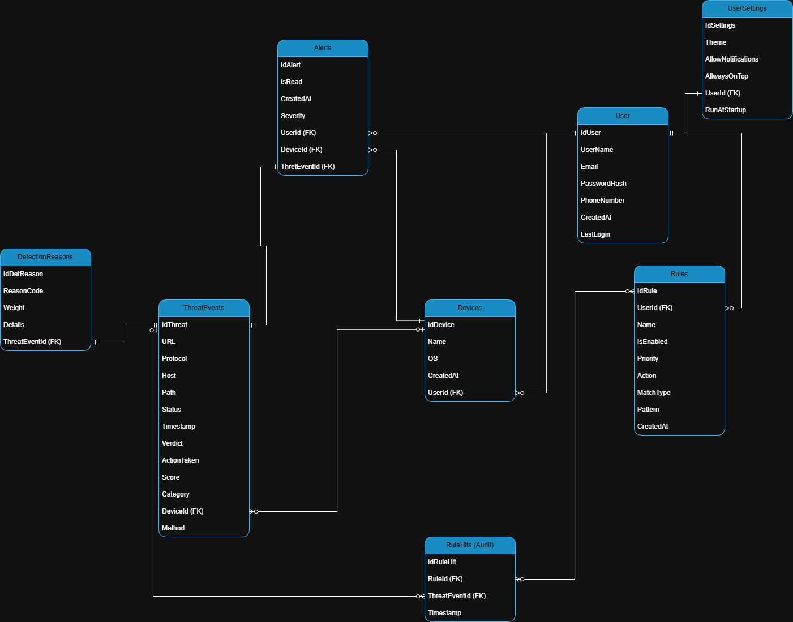

# Database Schema Documentation

This document describes the database design used by the application to detect,
analyze, and mitigate **phishing and malicious network traffic**.

The database is designed with the following principles:
- store **only malicious or suspicious traffic**
- provide **explainability** for detections
- support **user-defined security rules**
- maintain **auditability and traceability**
- minimize storage of sensitive data

---

## Overview



The schema is organized into the following logical layers:

- **User & Preferences**: users, settings, devices
- **Detection Core**: threat events and detection reasons
- **Policy Engine**: rules and rule audit
- **User Interaction**: alerts and notifications

---

# Tables

## 1) `User_Info`

### Purpose
Stores user accounts and authentication-related metadata.

### Columns
- **`IdUser`**  
  Primary key. Unique identifier for the user.
- **`UserName`**  
  Display name used in the application UI.
- **`Email`**  
  User email address. Must be unique.
- **`PasswordHash`**  
  Securely hashed password (never stored in plain text).
- **`PhoneNumber`**  
  Optional contact information.
- **`CreatedAt`**  
  Timestamp when the user account was created.
- **`LastLogin`**  
  Timestamp of the last successful login.
- **`UserRole`**
  Defines user permissions for authorization

### Relationships
- One user can own multiple devices.
- One user can define multiple rules.
- One user can receive multiple alerts.
- One user has one settings record.

---

## 2) `UserSettings`

### Purpose
Stores per-user application preferences and behavior-related settings.

### Columns
- **`IdSettings`**  
  Primary key.
- **`UserId`**  
  Foreign key to `User`.
- **`Theme`**  
  UI theme preference (e.g. Light / Dark).
- **`AllowNotifications`**  
  Enables or disables notifications.
- **`AlwaysOnTop`**  
  Controls window behavior in desktop mode.
- **`RunAtStartup`**  
  Determines whether the application starts with the OS.

### Relationships
- One-to-one relationship with `User`.

---

## 3) `Devices`

### Purpose
Represents devices where traffic monitoring is active.
Allows per-device analysis and reporting.

### Columns
- **`IdDevice`**  
  Primary key.
- **`UserId`**  
  Foreign key to `User`.
- **`Name`**  
  Device name (e.g. "DESKTOP-J360BI6").
- **`OS`**  
  Operating system information.
- **`CreatedAt`**  
  Device registration timestamp.

### Relationships
- One device belongs to one user.
- One device can generate multiple threat events.
- One device can trigger multiple alerts.

---

## 4) `ThreatEvents`

### Purpose
Core table storing **only suspicious or malicious network requests**.
This table is the foundation for detection, alerting, and reporting.

### Columns (Detection)
- **`IdThreat`**  
  Primary key.
- **`Timestamp`**  
  Time when the event was detected.
- **`Verdict`**  
  Classification result (e.g. `Suspicious`, `Phishing`, `Malware`).
- **`Score`**  
  Risk score representing severity.
- **`Category`**  
  Threat category (e.g. Phishing, Credential Theft).
- **`ActionTaken`**  
  Final enforcement action (`Allowed`, `Warned`, `Blocked`).

### Columns (Request Context)
- **`Protocol`**  
  Network protocol (HTTP, HTTPS, H2, WS).
- **`Method`**  
  HTTP method (GET, POST, etc.).
- **`Host`**  
  Destination domain name.
- **`Path`**  
  Requested URL path.
- **`URL`**  
  Full URL (stored only for threat-related traffic).
- **`DeviceId`**  
  Foreign key to `Devices`.

### Relationships
- One threat event belongs to one device.
- One threat event can have multiple detection reasons.
- One threat event can trigger multiple alerts.
- One threat event can match multiple rules.

---

## 5) `DetectionReasons`

### Purpose
Provides **explainability** for threat detection decisions.
A single threat event can have multiple contributing reasons.

### Columns
- **`IdDetReason`**  
  Primary key.
- **`ThreatEventId`**  
  Foreign key to `ThreatEvents`.
- **`ReasonCode`**  
  Detection signal identifier (e.g. `LookalikeDomain`, `BadReputation`).
- **`Weight`**  
  Contribution weight of the reason to the final score.
- **`Details`**  
  Structured details (JSON or text) explaining the detection.

### Example
```json
{
  "matchedDomain": "paypal.com",
  "levenshtein": 1,
  "homoglyph": true
}
```

## 6) `Rules`

### Purpose
Defines **user-configurable security policies** that control how detected traffic
is handled by the application.

Rules allow users to explicitly:
- block known malicious destinations
- allow trusted domains (allowlist)
- apply warnings instead of blocking
- override or complement automated detection logic

### Why it matters
Automated detection (heuristics / ML) can produce false positives.
Rules give **control and transparency** to the user.

Without rules:
- the system behaves like a black box
- users cannot correct or customize decisions

With rules:
- users can enforce their own security policies
- every decision can be explained and audited

---

### Columns
- **`IdRule`**  
  Primary key. Unique identifier of the rule.

- **`UserId`** *(FK)*  
  References the user who owns the rule.

- **`Name`**  
  Human-readable rule name (e.g. *"Block PayPal lookalikes"*).

- **`IsEnabled`**  
  Enables or disables the rule without deleting it.

- **`Priority`**  
  Determines evaluation order when multiple rules apply.  
  Lower value = higher priority (or follow a clearly defined convention).

- **`Action`**  
  Action applied when the rule matches:
  - `Allow`
  - `Warn`
  - `Block`

- **`MatchType`**  
  Defines how the rule matches traffic. Supported types include:
  - `Domain` – exact or wildcard domain match
  - `Url` – full URL match
  - `Path` – URL path match
  - `Regex` – regular expression
  - `Ip` – single IP address
  - `Cidr` – IP range
  - `Category` – threat category (e.g. Phishing)

- **`Pattern`**  
  The value evaluated according to `MatchType`
  (e.g. `paypal.com`, `/login`, regex expression).

- **`CreatedAt`**  
  Timestamp when the rule was created.

---

### Relationships
- One `User` can define multiple `Rules`
- One `Rule` can be applied to multiple `ThreatEvents`
- Rule applications are recorded in `RuleHits` for auditing

---

### Rule Evaluation Flow
1. Traffic is detected and classified as a `ThreatEvent`
2. Active rules are evaluated in **priority order**
3. When a rule matches:
   - its `Action` is applied (Allow / Warn / Block)
   - a record is written to `RuleHits`
4. The applied action is stored in `ThreatEvents.ActionTaken`

This ensures that **every enforced decision is traceable**.

---

### Example
```text
Rule:
  Name: "Block PayPal lookalikes"
  MatchType: Domain
  Pattern: paypal.com
  Action: Block
  Priority: 1

Result:
  If a domain visually imitates paypal.com,
  the request is blocked and logged.
```

## 7) `RuleHits` (Audit)

### Purpose
Stores an **audit trail** of which user-defined rules were matched/applied for each threat event.
This provides transparency, debugging, and analytics for the policy engine.

### Why it matters
- Explains *which rule* caused an action (Block/Warn/Allow)
- Helps detect rule conflicts (e.g., allowlist vs blocklist)
- Enables rule effectiveness reports (most/least used rules)

### Columns
- **`IdRuleHit`**  
  Primary key.
- **`RuleId`** *(FK)*  
  Reference to the rule that matched.
- **`ThreatEventId`** *(FK)*  
  Reference to the threat event affected by the rule.
- **`Timestamp`**  
  Time when the match/action was recorded.

### Relationships
- Many `RuleHits` belong to one `Rule`
- Many `RuleHits` belong to one `ThreatEvent`


## 8) `Alerts`

### Purpose
User-facing notifications generated from threat events.
Alerts support:
- in-app notification center
- unread counters
- historical review (what happened and when)

### Why it matters
- A threat event is a **security record**
- An alert is the **user interaction layer** (what the user sees)

### Columns
- **`IdAlert`**  
  Primary key.
- **`IsRead`**  
  Marks whether the user has viewed/dismissed the alert.
- **`CreatedAt`**  
  Alert creation timestamp.
- **`Severity`**  
  Severity label (e.g., Low / Medium / High), typically derived from `Score` and `Verdict`.
- **`UserId`** *(FK)*  
  Target user who receives the alert.
- **`DeviceId`** *(FK)*  
  Device where the threat occurred.
- **`ThreatEventId`** *(FK)*  
  The threat event that triggered this alert.

### Relationships
- Many `Alerts` belong to one `User`
- Many `Alerts` belong to one `Device`
- Many `Alerts` belong to one `ThreatEvent`


# Alerting & Auditing Flow

When suspicious traffic is detected:

1. A record is inserted into **`ThreatEvents`**
2. One or more explainability records are inserted into **`DetectionReasons`**
3. If a user rule matches, a record is inserted into **`RuleHits`** *(audit trail)*
4. If notifications are enabled, an **`Alerts`** record is created for the user/device

This separation keeps the security core (`ThreatEvents`) independent from UI/UX (`Alerts`)
while maintaining full transparency (`RuleHits`).
